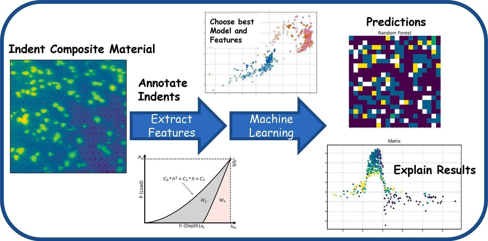

# Explainable Machine Learning Nanoindentation
Codes to the publication "Explainable machine learning and feature engineering applied to nanoindentation data"  (https://doi.org/10.1016/j.matdes.2025.113897)  published in Materials and Design and Dataset "The High-Speed Steel S390 Microclean™ Nanoindentation Dataset" (https://doi.org/10.5281/zenodo.15639081).

The repository is structured as follows:

XAI-Nanoindentation/

│

├── Results/

│   ├── cross-validation/

│   │   ├── *.pkl         ➜**Pickled results from the cross-validation workflow**

│   │   └── *.ipynb       ➜**Jupyter notebooks for plotting and analyzing CV results**

│   │ 

│   ├── models/

│   │   ├── *.pkl         ➜**Trained ML models and corresponding SHAP explainers**

│   │

│   ├── plots/

│   │   └── *.ipynb       ➜**Notebooks generating SHAP and other explanatory plots**

│

├── Supervised Machine Learning Pipelines/

│   └── *.ipynb           ➜**Cross-validation and model training pipelines**

│

├── *k*-means/

│   │

│   │ └── *.ipynb          ➜**Clustering analysis using *k*-means**

C.O.W. T. gratefully acknowledges the financial support under the scope of the UFO program (SPM - PN 3022) by the Austrian State of Styria (Land Steiermark - Abteilung 12 Wirtschaft, Tourismus, Wissenschaft und Forschung). 

    

